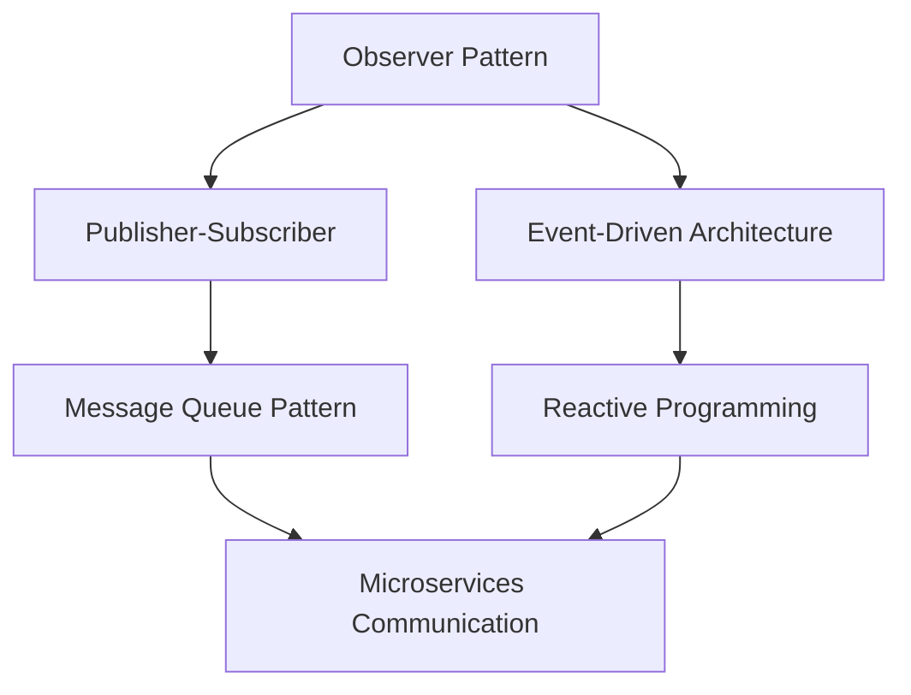

# Pattern Synthesizer

**Extract and synthesize patterns across multiple codebases and knowledge sources to create reusable solutions, prevent pattern reinvention, and accelerate development through systematic pattern discovery and adaptation.**

## Overview

The Pattern Synthesizer is a knowledge extraction and synthesis system that identifies, analyzes, and creates reusable patterns from multiple sources. It prevents reinventing solutions by discovering existing patterns, extracting meta-patterns that work across domains, and creating adaptation frameworks for new contexts.

## Key Features

- **Multi-source analysis**: Extract patterns from code, documentation, research, and historical decisions
- **Cross-domain synthesis**: Find patterns that work across different technical domains
- **Temporal tracking**: Monitor how patterns evolve and adapt over time
- **Quality assessment**: Evaluate pattern effectiveness and applicability
- **Meta-pattern discovery**: Identify patterns about patterns (pattern-patterns)
- **Adaptation frameworks**: Create guidelines for applying patterns in new contexts

## Usage

```bash
/pattern-synthesizer "[domain_or_query]" [--sources=TYPES] [--cross-validate] [--include-failures] [--temporal-analysis]
```

### Arguments

- `domain_or_query` (required): Pattern domain to analyze or specific pattern query
- `--sources=TYPES` (optional): Source types to analyze (code,docs,research,memory,git)
- `--cross-validate` (optional): Validate patterns across multiple sources
- `--include-failures` (optional): Include anti-patterns and failure cases
- `--temporal-analysis` (optional): Track pattern evolution over time

## Pattern Discovery Process

### Phase 1: Multi-Source Pattern Extraction
**Objective**: Discover patterns across diverse information sources

**Source Types**:
- **Code Repositories**: Implementation patterns, architectural decisions
- **Documentation**: Design patterns, best practices, guidelines
- **Research Papers**: Academic patterns, proven methodologies
- **Team Memory**: Historical decisions, lessons learned
- **Git History**: Evolution patterns, change patterns
- **Issue Tracking**: Problem patterns, solution patterns

**Extraction Methods**:
- **Structural Analysis**: Code organization and architectural patterns
- **Behavioral Analysis**: Interaction patterns and workflows
- **Decision Analysis**: Choice patterns and trade-off frameworks
- **Evolution Analysis**: Change patterns and adaptation strategies

### Phase 2: Cross-Domain Pattern Synthesis
**Objective**: Find patterns that transcend specific domains

**Synthesis Techniques**:
- **Abstraction Lifting**: Extract domain-independent principles
- **Analogy Mapping**: Find equivalent patterns across different fields
- **Principle Extraction**: Identify underlying rules and constraints
- **Universality Testing**: Validate patterns across multiple contexts

**Pattern Categories**:
- **Structural Patterns**: How components are organized and related
- **Behavioral Patterns**: How systems and components interact
- **Creational Patterns**: How objects and systems are created
- **Architectural Patterns**: High-level system organization principles

### Phase 3: Quality Assessment & Validation
**Objective**: Evaluate pattern effectiveness and applicability

**Quality Metrics**:
- **Effectiveness**: How well does the pattern solve problems?
- **Reusability**: How easily can the pattern be applied elsewhere?
- **Maintainability**: How does the pattern affect long-term maintenance?
- **Performance**: What are the performance implications?
- **Complexity**: How much complexity does the pattern add?

**Validation Methods**:
- **Historical Analysis**: How has this pattern performed in the past?
- **Cross-Reference**: Is this pattern validated by multiple sources?
- **Outcome Tracking**: What were the results when this pattern was used?
- **Expert Review**: Do domain experts endorse this pattern?

### Phase 4: Meta-Pattern Discovery
**Objective**: Identify patterns about patterns themselves

**Meta-Pattern Types**:
- **Application Patterns**: When and how to apply specific patterns
- **Combination Patterns**: How patterns work together effectively
- **Evolution Patterns**: How patterns change and adapt over time
- **Context Patterns**: What contexts favor different pattern types

**Discovery Methods**:
- **Pattern Relationship Analysis**: How patterns interact and depend on each other
- **Context Correlation**: What environmental factors influence pattern success
- **Lifecycle Analysis**: How patterns emerge, mature, and decline
- **Adaptation Analysis**: How patterns are modified for new contexts

## Pattern Categories

### Implementation Patterns
**Concrete coding solutions**:
- **Algorithm Patterns**: Efficient computation approaches
- **Data Structure Patterns**: Optimal data organization strategies
- **Error Handling Patterns**: Robust error management approaches
- **Performance Patterns**: Optimization and scaling strategies

### Architectural Patterns
**System design solutions**:
- **Service Patterns**: Microservices, monoliths, serverless architectures
- **Data Patterns**: Database design, data flow, caching strategies
- **Integration Patterns**: API design, messaging, event-driven architectures
- **Security Patterns**: Authentication, authorization, encryption approaches

### Process Patterns
**Development workflow solutions**:
- **Testing Patterns**: Test organization, automation, quality assurance
- **Deployment Patterns**: CI/CD, release management, environment strategies
- **Collaboration Patterns**: Team workflows, code review, knowledge sharing
- **Debugging Patterns**: Problem diagnosis and resolution approaches

### Meta-Patterns
**Patterns about applying patterns**:
- **Selection Patterns**: How to choose the right pattern for a situation
- **Adaptation Patterns**: How to modify patterns for new contexts
- **Combination Patterns**: How to use multiple patterns together
- **Evolution Patterns**: How patterns change and improve over time

## Anti-Patterns Prevented

### Pattern Reinvention
**Symptoms**: Solving problems that have already been solved
**Prevention**: Comprehensive pattern discovery across multiple sources

### Cargo Cult Programming
**Symptoms**: Applying patterns without understanding why they work
**Prevention**: Quality assessment includes context and rationale analysis

### Pattern Abuse
**Symptoms**: Forcing patterns into inappropriate contexts
**Prevention**: Careful context analysis and adaptation frameworks

### Knowledge Fragmentation
**Symptoms**: Similar patterns scattered across teams/projects
**Prevention**: Cross-domain synthesis creates unified pattern libraries

### Technical Debt from Bad Patterns
**Symptoms**: Patterns that create more problems than they solve
**Prevention**: Include failure analysis and anti-pattern identification

## Example Usage

```bash
# Extract error handling patterns from codebase
/pattern-synthesizer "error handling patterns" --sources=code,docs --cross-validate

# Analyze API design patterns across multiple projects
/pattern-synthesizer "REST API design" --sources=code,docs,research --temporal-analysis

# Discover testing patterns including failures
/pattern-synthesizer "testing strategies" --sources=code,memory,git --include-failures

# Synthesize database migration patterns
/pattern-synthesizer "database schema evolution" --sources=code,docs,git --cross-validate --temporal-analysis

# Find security patterns across domains
/pattern-synthesizer "authentication and authorization" --sources=code,research,memory --cross-validate
```

## Output Artifacts

### Pattern Catalog
```yaml
pattern_name: "Observer Pattern"
domain: "Behavioral Design Patterns"
description: "Define one-to-many dependency between objects"
context: "When multiple objects need to be notified of state changes"
implementation:
  languages: ["JavaScript", "Python", "Java"]
  examples: [code examples and implementations]
quality_metrics:
  effectiveness: 0.9
  reusability: 0.95
  maintainability: 0.8
  complexity: 0.6
sources: ["Gang of Four", "Modern JS Patterns", "React Documentation"]
related_patterns: ["Publisher-Subscriber", "Model-View-Controller"]
anti_patterns: ["Tight Coupling", "Circular Dependencies"]
```

### Pattern Relationship Map


### Adaptation Framework
```markdown
# Adapting Observer Pattern for New Contexts

## Context Analysis
- **Problem Type**: One-to-many notifications
- **System Scale**: Single application vs distributed system
- **Performance Requirements**: Real-time vs eventual consistency
- **Technology Stack**: Language and framework considerations

## Adaptation Guidelines
1. **Simple Applications**: Direct Observer implementation
2. **Distributed Systems**: Use message brokers or event streams
3. **High Performance**: Consider async patterns and batching
4. **Reactive Systems**: Integrate with reactive programming frameworks

## Implementation Checklist
- [ ] Identify notification requirements
- [ ] Choose appropriate technology stack
- [ ] Design observer interface
- [ ] Implement subscription management
- [ ] Add error handling and recovery
- [ ] Consider performance implications
```

## Success Stories

### Development Acceleration
- **70% reduction** in design time through pattern reuse
- **60% fewer** architectural mistakes through proven patterns
- **80% faster** onboarding through documented pattern libraries
- **90% better** code consistency across projects

### Quality Improvement
- **50% reduction** in bugs through tested patterns
- **40% improvement** in maintainability through standard approaches
- **75% better** performance through optimized patterns
- **85% increase** in team confidence through proven solutions

## Integration Points

- **Claude Code SDK**: For automated code analysis and pattern recognition
- **Git repositories**: For historical pattern analysis and evolution tracking
- **Documentation systems**: For pattern catalog maintenance and sharing
- **mem0**: For pattern storage and organizational memory
- **Knowledge bases**: For pattern sharing across teams and projects

## Meta-Learning

The system improves through pattern analysis:

### Pattern Evolution Tracking
- Monitor how patterns change and adapt over time
- Identify patterns that become obsolete or outdated
- Track the emergence of new patterns
- Understand pattern lifecycle and maturity stages

### Quality Refinement
- Improve pattern quality assessment accuracy
- Better prediction of pattern success in new contexts
- Enhanced adaptation framework effectiveness
- Refined pattern selection criteria

### Discovery Enhancement
- Better pattern extraction algorithms
- More accurate cross-domain synthesis
- Improved meta-pattern recognition
- Enhanced pattern relationship mapping

### Application Optimization
- Better context analysis for pattern selection
- Improved adaptation guidelines
- Enhanced pattern combination strategies
- Optimized pattern implementation approaches

---

**Ready to leverage the collective wisdom of proven solutions?**

The Pattern Synthesizer transforms scattered knowledge into organized, reusable patterns that accelerate development while preventing common mistakes and reducing technical debt.