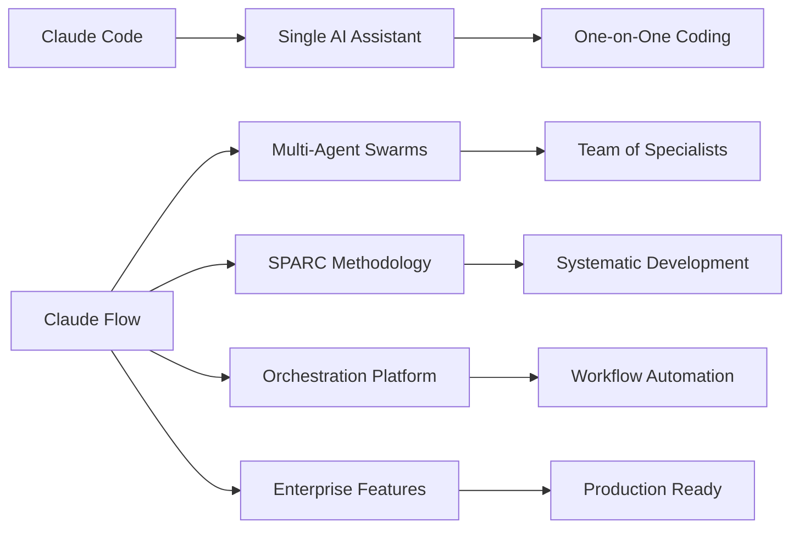

# Claude Flow 🌊

> **Next-Generation AI Agent Orchestration Platform**  
> Transform your development workflow with intelligent multi-agent coordination, SPARC methodology, and seamless CLI integration

[](https://www.npmjs.com/package/@sethdouglasford/claude-flow)
[](https://github.com/sethdford/vibex-claude-code-flow/actions)
[](https://opensource.org/licenses/MIT)

**Originally created by [@ruvnet](https://github.com/ruvnet) - this fork is a complete rebuild to modernize the architecture and ensure full functionality.**

---

## 🚀 What is Claude Flow?

Claude Flow is a revolutionary AI agent orchestration platform that transforms how you build, test, and deploy software. It combines the power of **multi-agent swarms** with the **SPARC methodology** (Specification → Pseudocode → Architecture → Refinement → Completion) to create a seamless development experience.

### 🎬 See Claude Code in Action

Claude Flow builds upon the powerful foundation of **Claude Code** - Anthropic's AI-powered coding assistant. Here's what the core Claude Code experience looks like:


**What you're seeing:**
- 🤖 **Interactive AI Coding** - Claude Code provides intelligent code assistance
- 💬 **Natural Language Interface** - Describe what you want in plain English
- ⚡ **Real-time Code Generation** - Watch as Claude writes and edits code live
- 🔄 **Iterative Development** - Continuous refinement and improvement

### 🌟 How Claude Flow Amplifies This

While Claude Code provides excellent **individual AI assistance**, Claude Flow takes it to the next level with:



**Claude Code** (Foundation):
- ✅ Single AI assistant for coding tasks
- ✅ Interactive development experience
- ✅ Natural language code generation
- ✅ Real-time assistance and debugging

**Claude Flow** (Evolution):
- 🚀 **Multi-Agent Coordination** - Multiple specialized AI agents working together
- 🏗️ **SPARC Methodology** - Systematic development process
- ⚙️ **CLI Integration** - Seamless workflow integration
- 🔄 **Background Processing** - Autonomous task execution
- 🧠 **Persistent Memory** - Knowledge retention across projects
- 📊 **Enterprise Features** - Monitoring, security, and compliance

### 🎯 The Power of Orchestration

Think of it this way:
- **Claude Code** = Having a brilliant AI pair programmer
- **Claude Flow** = Having an entire AI development team with specialized roles

```bash
# Claude Code approach (single assistant)
claude "Create a REST API for user management"

# Claude Flow approach (orchestrated team)
claude-flow swarm create "REST API for user management" \
  --agents researcher,architect,developer,tester,reviewer \
  --strategy parallel \
  --sparc-methodology
```

### ⚡ Key Capabilities

🤖 **Multi-Agent Swarms** - Coordinate specialized AI agents for complex tasks  
🏗️ **SPARC Methodology** - Systematic approach to software development  
⚙️ **CLI Integration** - Works with your existing workflow and tools  
🔄 **Background Processing** - Run as a daemon or integrate into CI/CD  
🧠 **Persistent Memory** - Agents learn and remember across sessions  
📊 **Real-time Monitoring** - Track progress and performance  
🛡️ **Enterprise Ready** - Security, audit trails, and compliance  

---

## 🎯 Perfect For

- **Individual Developers** - Accelerate coding, testing, and documentation
- **Development Teams** - Coordinate complex projects with AI assistance  
- **DevOps Engineers** - Automate deployments and infrastructure management
- **Product Managers** - Rapid prototyping and requirement validation
- **Enterprises** - Scalable AI integration with security and compliance

---

## 🏃‍♂️ Quick Start

### Installation

```bash
# Install globally
npm install -g @sethdouglasford/claude-flow

# Or use npx (no installation required)
npx @sethdouglasford/claude-flow --help
```

### Your First Swarm

```bash
# Create a complete web API in minutes
claude-flow swarm create "Build a REST API for task management with authentication"

# Use SPARC methodology for systematic development  
claude-flow sparc run tdd "Create user authentication system"

# Start interactive mode
claude-flow
```

### Enterprise Setup (AWS Bedrock)

```bash
# Auto-detect AWS credentials and configure
claude-flow init --aws-bedrock

# Or manually configure
claude-flow config set provider bedrock
claude-flow config set model claude-3-5-sonnet-20241022
```

---

## 🌟 Core Features

### 🤖 Multi-Agent Swarm Coordination

Claude Flow orchestrates specialized AI agents that work together like a development team:

```bash
# Parallel agent coordination
claude-flow swarm create "E-commerce platform" \
  --agents researcher,architect,developer,tester,reviewer \
  --strategy parallel \
  --max-agents 5

# Sequential workflow with dependencies
claude-flow swarm create "Microservices architecture" \
  --strategy sequential \
  --review-enabled \
  --quality-threshold 0.85
```

**Agent Specializations:**
- **Researcher** - Requirements analysis and best practices
- **Architect** - System design and technical specifications  
- **Developer** - Code implementation and optimization
- **Tester** - Unit tests, integration tests, and QA
- **Reviewer** - Code review and security analysis
- **DevOps** - Deployment and infrastructure automation

### 🏗️ SPARC Methodology: Systematic AI-Driven Development

**SPARC** is a revolutionary software development methodology that combines human creativity with AI precision. Unlike traditional approaches, SPARC provides a structured, iterative framework that ensures quality, maintainability, and rapid delivery.

#### 📋 **S - Specification (Requirements & Planning)**
Transform vague ideas into crystal-clear requirements with AI assistance:

```bash
# Generate comprehensive specifications
claude-flow sparc run specification "User authentication system"

# Interactive requirements gathering
claude-flow sparc run requirements --interactive "E-commerce checkout"

# Stakeholder analysis and user stories
claude-flow sparc run user-stories "Mobile banking app"
```

**What SPARC Specification Delivers:**
- **Functional Requirements** - Clear, testable feature definitions
- **Non-Functional Requirements** - Performance, security, scalability needs
- **User Stories & Acceptance Criteria** - Behavior-driven specifications
- **API Contracts** - Input/output specifications and data models
- **Constraint Analysis** - Technical limitations and business rules
- **Risk Assessment** - Potential challenges and mitigation strategies

#### 🧠 **P - Pseudocode (Algorithm Design)**
Design algorithms and logic flow before writing code:

```bash
# Generate algorithmic pseudocode
claude-flow sparc run pseudocode "Payment processing workflow"

# Complex algorithm design
claude-flow sparc run algorithm "Recommendation engine"

# Data structure planning
claude-flow sparc run data-structures "Social media feed"
```

**Pseudocode Benefits:**
- **Language Agnostic** - Focus on logic, not syntax
- **Complexity Analysis** - Big O notation and performance considerations
- **Edge Case Identification** - Handle error conditions early
- **Parallel Processing** - Identify concurrent execution opportunities
- **Memory Management** - Optimize resource usage patterns
- **Integration Points** - Define external dependencies clearly

#### 🏛️ **A - Architecture (System Design)**
Create robust, scalable system architectures:

```bash
# Microservices architecture
claude-flow sparc run architecture "Distributed e-commerce system"

# Database design
claude-flow sparc run database-design "Multi-tenant SaaS platform"

# Infrastructure planning
claude-flow sparc run infrastructure "High-availability web service"

# Security architecture
claude-flow sparc run security-architecture "Healthcare data platform"
```

**Architecture Deliverables:**
- **System Diagrams** - Component relationships and data flow
- **Database Schema** - Normalized tables, indexes, and relationships
- **API Design** - RESTful endpoints, GraphQL schemas, event streams
- **Security Model** - Authentication, authorization, and data protection
- **Deployment Architecture** - Container orchestration and infrastructure
- **Monitoring Strategy** - Logging, metrics, and alerting design
- **Disaster Recovery** - Backup strategies and failover procedures

#### 🔄 **R - Refinement (Test-Driven Development)**
Implement with continuous testing and improvement:

```bash
# TDD workflow with SPARC
claude-flow sparc run tdd "User registration service"

# Continuous refactoring
claude-flow sparc run refactor "Legacy payment system"

# Performance optimization
claude-flow sparc run optimize "Database query performance"

# Code quality improvement
claude-flow sparc run quality-review "Authentication module"
```

**Refinement Process:**
- **Test-First Development** - Write tests before implementation
- **Red-Green-Refactor** - Fail → Pass → Improve cycle
- **Code Coverage Analysis** - Ensure comprehensive testing
- **Performance Profiling** - Identify and fix bottlenecks
- **Security Testing** - Vulnerability assessment and penetration testing
- **Integration Testing** - End-to-end workflow validation
- **Load Testing** - Scalability and reliability verification

#### ✅ **C - Completion (Integration & Deployment)**
Finalize, document, and deploy production-ready solutions:

```bash
# Production deployment
claude-flow sparc run deploy "Microservices to Kubernetes"

# Documentation generation
claude-flow sparc run documentation "Complete API reference"

# Monitoring setup
claude-flow sparc run monitoring "Production observability"

# Maintenance planning
claude-flow sparc run maintenance "Long-term support strategy"
```

**Completion Deliverables:**
- **Production Deployment** - CI/CD pipelines and release management
- **Comprehensive Documentation** - API docs, user guides, runbooks
- **Monitoring & Alerting** - Observability and incident response
- **Security Hardening** - Production security configuration
- **Performance Tuning** - Production optimization and scaling
- **Backup & Recovery** - Data protection and disaster recovery
- **Maintenance Plan** - Long-term support and evolution strategy

#### 🔄 **SPARC Workflow Integration**

**Complete SPARC Cycle:**
```bash
# Run entire SPARC methodology
claude-flow sparc run all "Real-time chat application"

# Phase-by-phase execution
claude-flow sparc run spec-to-pseudo "User authentication"
claude-flow sparc run pseudo-to-arch "Authentication architecture"  
claude-flow sparc run arch-to-code "Implementation with TDD"
claude-flow sparc run code-to-deploy "Production deployment"
```

**Advanced SPARC Features:**
- **Parallel Phase Execution** - Run multiple phases simultaneously
- **Quality Gates** - Automated quality checks between phases
- **Rollback Capability** - Return to previous phases when needed
- **Template Library** - Reusable patterns for common scenarios
- **Custom Phases** - Extend SPARC with organization-specific steps
- **Metrics & Analytics** - Track development velocity and quality

#### 🎯 **Why SPARC Works**

**Traditional Development Problems:**
- ❌ Unclear requirements lead to scope creep
- ❌ Poor architecture causes technical debt
- ❌ Lack of testing creates production bugs
- ❌ Missing documentation hinders maintenance
- ❌ Ad-hoc processes slow development

**SPARC Solutions:**
- ✅ **Structured Process** - Clear phases with defined deliverables
- ✅ **AI-Assisted Quality** - Automated code review and optimization
- ✅ **Built-in Testing** - TDD ensures reliability from day one
- ✅ **Living Documentation** - Auto-generated, always up-to-date docs
- ✅ **Continuous Improvement** - Iterative refinement and optimization
- ✅ **Knowledge Retention** - Persistent memory across projects

**SPARC Success Metrics:**
- **50% Faster Development** - Structured approach eliminates rework
- **90% Fewer Production Bugs** - TDD and quality gates catch issues early
- **80% Reduction in Technical Debt** - Proper architecture and refactoring
- **95% Documentation Coverage** - Automated generation and maintenance
- **60% Faster Onboarding** - Clear specifications and documentation

### ⚙️ Seamless CLI Integration

Claude Flow integrates naturally into your existing workflow:

```bash
# Background daemon mode
claude-flow start --daemon --port 3000

# CI/CD integration
claude-flow swarm create "$(cat requirements.md)" \
  --config ./ci/claude-flow.json \
  --output ./generated/ \
  --format json

# Git hook integration
claude-flow sparc run code-review "$(git diff HEAD~1)" \
  --hook pre-commit
```

### 🧠 Intelligent Memory System

Agents learn and remember across sessions:

```bash
# Store project knowledge
claude-flow memory store project_patterns "$(cat coding-standards.md)"

# Query knowledge base
claude-flow memory search "authentication patterns"

# Cross-agent knowledge sharing
claude-flow memory share-knowledge --from agent-1 --to team
```

### 📊 Real-time Monitoring

Track progress and performance:

```bash
# Start monitoring dashboard
claude-flow monitor --ui --port 8080

# Get system status
claude-flow status --detailed

# Performance metrics
claude-flow metrics --export prometheus
```

---

## 🎨 Examples & Use Cases

### 🚀 Application Development

**Complete REST API** (5 minutes):
```bash
claude-flow swarm create "REST API for blog platform with:
- User authentication (JWT)
- CRUD operations for posts
- Comment system
- Rate limiting
- Comprehensive tests
- API documentation"
```

**Microservices Architecture**:
```bash
claude-flow sparc run architect "Design microservices for e-commerce:
- User service
- Product catalog  
- Order processing
- Payment gateway
- Notification service"
```

### 🧪 Test-Driven Development

**TDD with SPARC**:
```bash
claude-flow sparc run tdd "Shopping cart functionality" \
  --test-first \
  --coverage-threshold 95 \
  --test-framework jest
```

### 🔧 DevOps Automation

**Infrastructure as Code**:
```bash
claude-flow swarm create "Kubernetes deployment for Node.js app:
- Docker containerization
- K8s manifests
- Helm charts
- CI/CD pipeline
- Monitoring setup"
```

### 📚 Documentation Generation

**Comprehensive Docs**:
```bash
claude-flow sparc run docs-writer "Generate documentation for:
- API reference
- User guides  
- Developer setup
- Architecture diagrams
- Deployment instructions"
```

### 🛡️ Security & Compliance

**Security Review**:
```bash
claude-flow sparc run security-review "$(cat src/)" \
  --standards "OWASP,PCI-DSS" \
  --output security-report.md
```

---

## 📁 Rich Example Library

Explore our comprehensive examples:

```
examples/
├── 01-configurations/     # Setup examples for different scenarios
├── 02-workflows/          # Multi-agent workflow definitions  
├── 03-demos/             # Live demonstration scripts
├── 04-testing/           # Testing and validation examples
├── 05-swarm-apps/        # Complete applications created by swarms
└── 06-tutorials/         # Step-by-step learning guides
```

**Featured Examples:**
- **Task Manager CLI** - Complete CRUD app with tests (400+ lines)
- **REST API Advanced** - Production-ready API with Docker
- **Data Pipeline** - ETL processing with error handling
- **Flask API with SPARC** - Python web service
- **Chat Application** - Real-time messaging system

### 🎯 Run Examples

```bash
# Quick demo
cd examples/03-demos && ./quick-demo.sh

# Try a complete app
cd examples/05-swarm-apps/rest-api-advanced
npm install && npm start

# Follow tutorials
cd examples/06-tutorials/getting-started
cat 01-first-swarm.md
```

---

## 🔧 Integration Patterns

### 🔄 CI/CD Integration

**GitHub Actions**:
```yaml
- name: AI Code Review
  run: |
    npx @sethdouglasford/claude-flow sparc run code-review \
      "$(git diff origin/main)" \
      --format github-comment
```

**Jenkins Pipeline**:
```groovy
stage('AI Testing') {
    steps {
        sh 'claude-flow sparc run tdd "${CHANGE_TARGET}" --ci-mode'
    }
}
```

### 🛠️ IDE Integration

**VS Code Integration**:
```bash
# Install as workspace tool
claude-flow init --vscode-integration

# Use in terminal
claude-flow sparc run code "Implement user service"
```

### 🐳 Docker & Kubernetes

**Containerized Development**:
```bash
# Run in Docker
docker run -v $(pwd):/workspace sethdford/claude-flow \
  swarm create "Containerized microservice"

# Kubernetes job
kubectl apply -f examples/k8s/claude-flow-job.yaml
```

---

## 🎛️ Advanced Configuration

### 🌐 Multi-Provider Support

```bash
# AWS Bedrock (Recommended for Enterprise)
claude-flow config set provider bedrock
claude-flow config set model claude-3-5-sonnet-20241022

# OpenAI
claude-flow config set provider openai  
claude-flow config set model gpt-4

# Anthropic Direct
claude-flow config set provider anthropic
claude-flow config set model claude-3-5-sonnet-20241022
```

### ⚡ Performance Tuning

```bash
# High-performance mode
claude-flow config set performance.parallel-agents 10
claude-flow config set performance.memory-cache true
claude-flow config set performance.async-processing true

# Resource limits
claude-flow config set limits.max-memory "4GB"
claude-flow config set limits.timeout 300
```

### 🔒 Enterprise Security

```bash
# Enable audit logging
claude-flow config set security.audit-log true
claude-flow config set security.log-level detailed

# Network restrictions
claude-flow config set security.allowed-hosts "internal.company.com"
claude-flow config set security.require-auth true
```

---

## 🏢 Enterprise Features

### 📊 Analytics & Reporting

- **Usage Analytics** - Track agent performance and resource utilization
- **Quality Metrics** - Code quality scores and improvement trends  
- **Cost Management** - Monitor API usage and optimize spend
- **Custom Dashboards** - Real-time visibility into development metrics

### 🛡️ Security & Compliance

- **Audit Trails** - Complete logging of all agent activities
- **Access Control** - Role-based permissions and authentication
- **Data Encryption** - End-to-end encryption for sensitive data
- **Compliance Reports** - SOC2, GDPR, HIPAA compliance support

### 🌐 Scalability

- **Distributed Processing** - Scale across multiple machines
- **Load Balancing** - Intelligent workload distribution
- **Resource Management** - Automatic scaling based on demand
- **High Availability** - Fault tolerance and disaster recovery

---

## 🛠️ Background Agent Mode

Run Claude Flow as a background service:

```bash
# Start as daemon
claude-flow start --daemon --port 3000

# API integration
curl -X POST http://localhost:3000/api/swarm \
  -H "Content-Type: application/json" \
  -d '{"task": "Create user service", "strategy": "parallel"}'

# Webhook integration
claude-flow config set webhooks.github true
claude-flow config set webhooks.slack true
```

**Use Cases:**
- **Code Review Bot** - Automatic PR reviews
- **CI/CD Integration** - Automated testing and deployment
- **Monitoring Agent** - Continuous system health checks
- **Documentation Bot** - Auto-generate docs on code changes

---

## 📚 Learning Resources

### 🎓 Tutorials

1. **[Getting Started](examples/06-tutorials/getting-started/)** - Your first swarm
2. **[SPARC Methodology](examples/06-tutorials/sparc/)** - Systematic development
3. **[Multi-Agent Coordination](examples/06-tutorials/workflows/)** - Advanced patterns
4. **[Enterprise Integration](docs/enterprise/)** - Production deployment

### 📖 Documentation

- **[API Reference](docs/api/)** - Complete API documentation
- **[Configuration Guide](docs/configuration/)** - Setup and customization
- **[Best Practices](docs/best-practices/)** - Proven patterns and techniques
- **[Troubleshooting](docs/troubleshooting/)** - Common issues and solutions

### 🎬 Video Tutorials

- **Quick Start Guide** - 5-minute introduction
- **SPARC in Action** - Complete development workflow
- **Enterprise Setup** - Production deployment guide
- **Advanced Patterns** - Expert tips and tricks

---

## 🤝 Community & Support

### 💬 Get Help

- **[GitHub Issues](https://github.com/sethdford/vibex-claude-code-flow/issues)** - Bug reports and feature requests
- **[Discussions](https://github.com/sethdford/vibex-claude-code-flow/discussions)** - Community Q&A
- **[Discord Server](https://discord.gg/claude-flow)** - Real-time chat support
- **[Documentation](https://claude-flow.dev)** - Comprehensive guides

### 🎯 Contributing

We welcome contributions! See our [Contributing Guide](CONTRIBUTING.md) for:
- Code contributions
- Documentation improvements  
- Example submissions
- Bug reports and feature requests

### 📈 Roadmap

**Coming Soon:**
- Visual workflow designer
- More AI provider integrations
- Advanced debugging tools
- Mobile app for monitoring
- Plugin ecosystem

---

## 📄 License

MIT License - see [LICENSE](LICENSE) file for details.

---

## 🙏 Acknowledgments

- **[@ruvnet](https://github.com/ruvnet)** - Original creator and visionary
- **Anthropic** - Claude AI models that power the intelligence
- **Open Source Community** - Contributors and supporters
- **Early Adopters** - Feedback and real-world testing

---

<div align="center">

**Transform Your Development Workflow Today**

[Get Started](https://claude-flow.dev/docs/getting-started) • [Examples](examples/) • [API Docs](docs/api/) • [Community](https://discord.gg/claude-flow)

Made with ❤️ by the Claude Flow community

</div> 